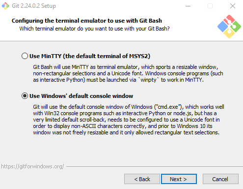
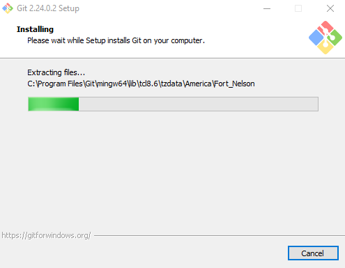
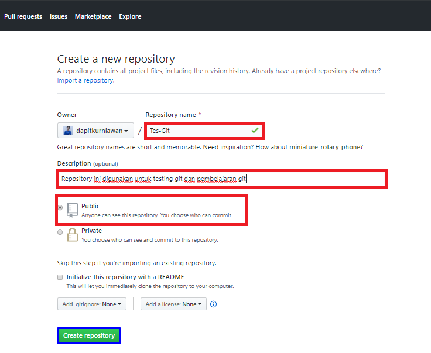

## tugas-program 
## Belajar HTML

### membuat Tutorial VCS 
Berikut adalah langah-langkah pengunanaan git

Cara Instal Git di windows
cara instal git di windows, Berikut adalah penjelasanya:

1. Dowwnload file Git
Untuk menginstall Git, Anda perlu mengunduh file-nya terlebih dahulu di situs resminya. Download sesuai tipe sistem operasi pada komputer Anda. Apabila tipe sistem operasi komputer Anda 64bit,  pilih Git yang mendukung Windows 64bit. Tujuannya adalah agar tidak terjadi error saat proses instalasi Git.

2. Install Git
Setelah selesai mengunduh file Git, buka setup aplikasi Git untuk memulai proses instalasi. Halaman awal setelah Anda membuka setup aplikasi Git adalah tampilan Document License dari Git. Klik Next untuk melanjutkan instalasi.

3. Tentukan Lokasi Instalasi Git
Selanjutnya, pilih lokasi untuk install Git pada komputer Anda. Pada tutorial ini kami menginstall di lokasi C:\Program Files\Git. Setelah menentukan lokasi instalasi Git, klik Next untuk melanjutkan.

4. Pilih Komponen Tambahan
Kemudian pilih komponen tambahan untuk install Git. Fungsi komponen ini adalah untuk memperlancar penggunaan Git dan mendukung file dengan kapasitas besar. Sesuaikan komponen tambahan yang dipilih seperti pada gambar di bawah ini. Jika sudah klik Next untuk melanjutkan instalasi.

5. Tentukan Nama Aplikasi Git
Sebenarnya Anda bebas mengganti nama aplikasi Git yang akan ditampilkan pada Start Menu. Akan tetapi, demi kemudahan saat mencari aplikasi ini, sebaiknya gunakan nama Git saja.

6. Tentukan File Editor
Untuk mengedit script melalui Git, Anda memerlukan file editor. Anda bebas menggunakan file editor apa pun untuk dikombinasikan dengan Git. Pada tutorial ini, kami menggunakan Vim Editor. Klik Next apabila Anda sudah menentukan file editor yang akan Anda gunakan. 

7. Atur Path Environment
Selanjutnya adalah pengaturan Path Environment. Path Environment berfungsi untuk mengeksekusi perintah perintah pada Git. Pilih Git from the command line and also from 3rd-party software agar saat menjalankan perintah Git dapat dikenali di Command Prompt (CMD) pada Windows. 

8. Pilih Aplikasi SSH
Kemudian untuk mengeksekusi SSH, Anda bisa menggunakan aplikasi dari Git atau  dari platform lain seperti PuTTY dan Bitvise. Pada tutorial ini kami menggunakan Use OpenSSH, aplikasi default SSH dari Git. Klik Next untuk melanjutkan instalasi. 

9. Pilih Line Ending
Selanjutnya, Anda perlu memilih pengaturan line ending. Pada tutorial ini kami memilih Checkout Windows-style, commit Unix-style line endings. Klik Next untuk melanjutkan instalasi.

10. Pilih Emulator Terminal
Setelah itu, Anda perlu memilih emulator terminal yang akan digunakan. Anda bisa menggunakan Command Prompt atau MinTTY. Karena ingin menggunakan Command Prompt, pada tutorial ini kami memilih Use Windows’ default console windows. Klik Next untuk melanjutkan instalasi. 

11. Tentukan Opsi ekstra
Terdapat beberapa opsi ekstra yang bisa Anda pilih. Pertama, pilih Enable File System Caching agar Git memiliki fungsi system caching. Kedua, pilih Enable Git Credential Manager agar Git bisa dikombinasikan dengan aplikasi lain seperti Visual Studio, Android Studio, dan GitHub. Klik Next untuk melanjutkan instalasi.

12. Mulai Proses Instalasi
Setelah menambahkan konfigurasi ekstra pada Git, Anda bisa memulai proses instalasi Git. Klik Install untuk melanjutkan proses.

13. Cara Menggunakan Git
Setelah berhasil install ke Git, selanjutnya kami akan memberikan 10 langkah menggunakan Git. Berikut ini adalah sembilang langkah menggunakan Git.

14. Login Github
Langkah kedua dalam belajar menggunakan Git adalah Anda harus login ke dalam website GitHub. Github dan Git memiliki hubungan khusus, yaitu Git yang berperan sebagai version control system dan Github menjadi hosting atau sebagai penyimpan kode pemrograman.

Setelah Anda login, akan muncul tampilan dashboard dari GitHub seperti  gambar di bawah ini.

15. Buat Repository
Setelah berhasil login ke GitHub, Anda bisa mulai membuat repository. Klik tombol New pada menu Repositories untuk membuat repository baru.

16. Buat Folder pada Windows
Selanjutnya, Anda perlu membuat folder pada local disk komputer Anda. Fungsinya adalah untuk menyimpan update file dari repository GitHub yang telah Anda buat.

17. Buka Folder Menggunakan Git Bash

18. Ubah Folder Menjadi Repository
Setelah itu, ubah folder tersebut menjadi repository menggunakan perintah berikut:

$ git init

19. Untuk bisa menambahkan file ke repository GitHub, Anda perlu menerapkan langkah-langkah di bawah ini:

Buat file di folder yang sudah dibuat (Test Git). Contohnya, di sini kami membuat file index.php

Buka GitBash lalu masukkan perintah berikut:

20. Buat Commit
Selanjutnya, Anda perlu membuat Commit. Commit berfungsi untuk menambahkan update file serta komentar. Jadi setiap kontributor bisa memberikan konfirmasi update file di proyek yang sedang dikerjakan. Masukkan perintah berikut untuk membuat Commit:

$ git commit -m "first commit"

Pada tutorial ini kami membuat first commit sebagai Commit pertama kami. Anda bebas membuat membuat nama Commit apa saja.

21. Cek File
Setelah itu, cek repository yang telah Anda buat. Anda akan mendapati file-file yang telah ditambahkan sebelumnya. Pada tutorial ini kami menambahkan tiga file, yaitu index.php, single.php, dan README.txt.

